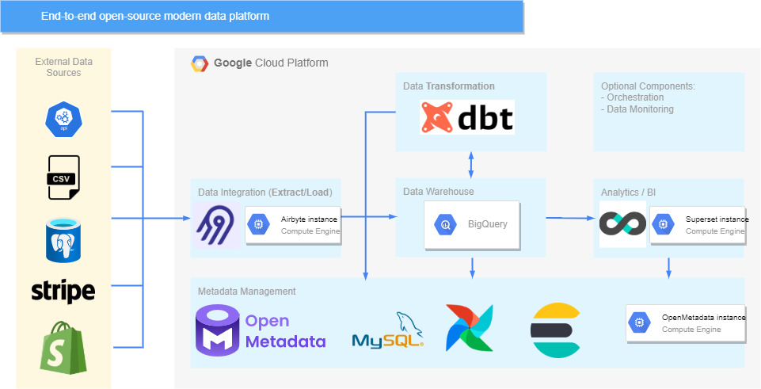

# data-warehouse-dbt

### dashboard : [herokuapp](https://secret-tundra-32787.herokuapp.com/)



## Introduction

A city traffic department wants to collect traffic data using swarm UAVs (drones) from a number of locations in the city and use the data collected for improving traffic flow in the city and for a number of other undisclosed projects. This project is responsible for creating a scalable data warehouse that will host the vehicle trajectory data extracted by analysing footage taken by swarm drones and static roadside cameras.

The Project will use the Extract Load Transform (ELT) framework using DBT. Unlike the Extract, Transform, Load (ETL), the ELT framework helps analytic engineers in the city traffic department setup transformation workflows on a need basis.

## Data

In Downloads — pNEUMA | open-traffic (epfl.ch) you can find a pNEUMA data: pNEUMA is an open large-scale dataset of naturalistic trajectories of half a million vehicles that have been collected by a one-of-a-kind experiment by a swarm of drones in the congested downtown area of Athens, Greece. Each file for a single (area, date, time) is ~87MB data.

## Installations

```bash
git clone https://github.com/Abel-Blue/data-warehouse-dbt.git
cd data-warehouse-dbt
sudo python3 setup.py install
```

then

```bash
 docker-compose build
 docker-compose up
```

<hr>

# <a name='license'></a>License

[MIT-License](https://github.com/Abel-Blue/data-warehouse-dbt/blob/main/LICENSE)
